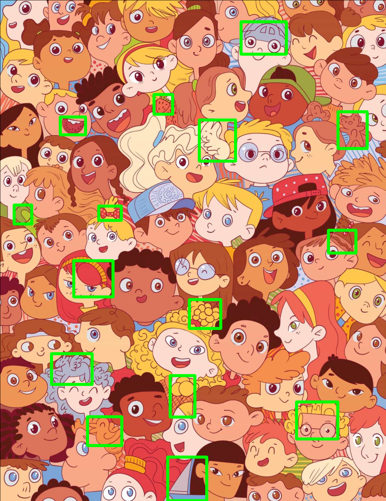
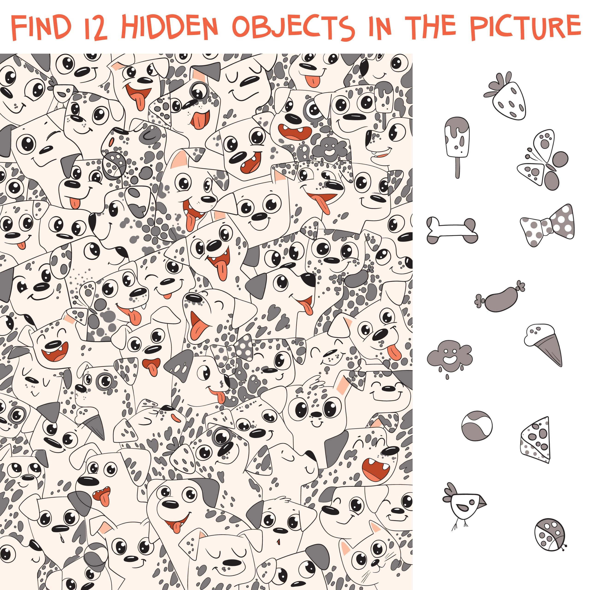
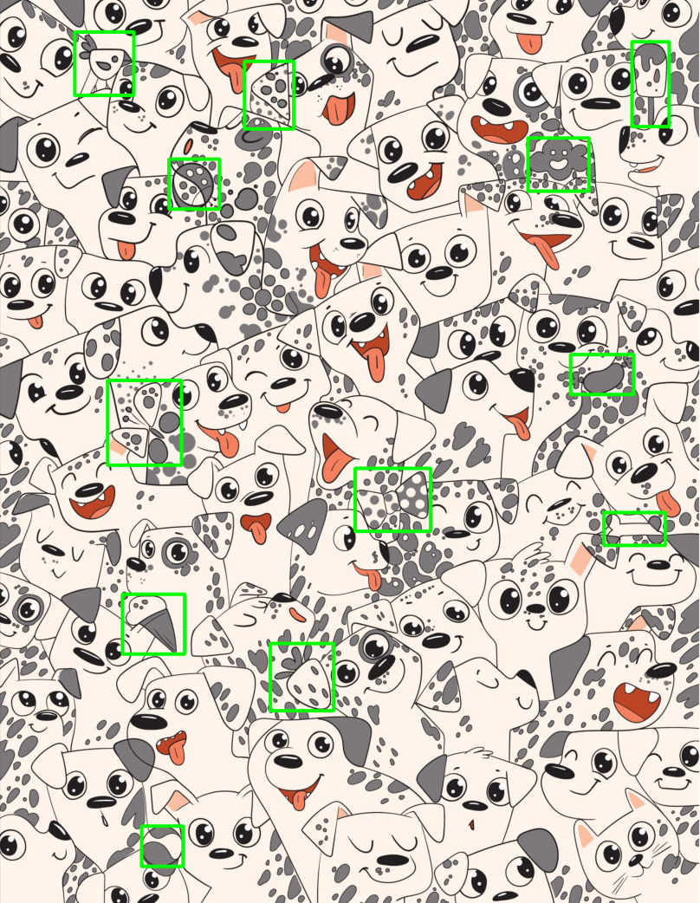

## Sử dụng phương pháp template matching để thực hiện tìm kiếm vật thể trong ảnh

### Hình ảnh 1

Kết quả sau khi áp dụng thuật toán Canny để lấy cạnh và áp dụng template matching. Xem chi tiết hơn ở file: <a href="./report_img1.ipynb">report_img1.ipynb</a>

### Hình ảnh 2

Kết quả sau khi áp dụng phương pháp template matching. Xem chi tiết hơn ở file: <a href="./report_img2.ipynb">report_img1.ipynb</a>

